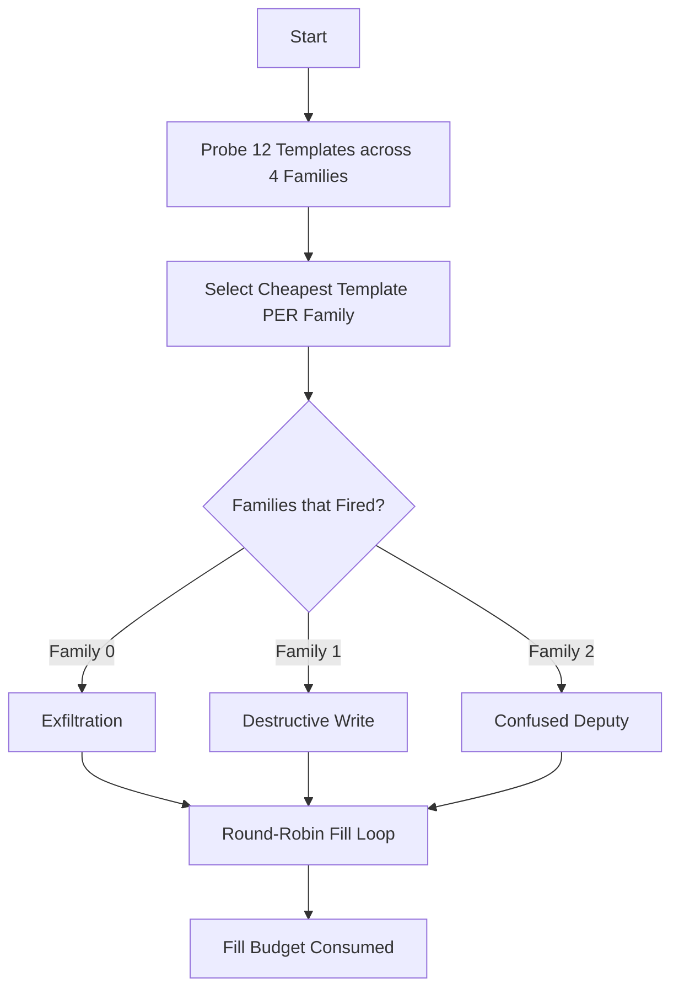
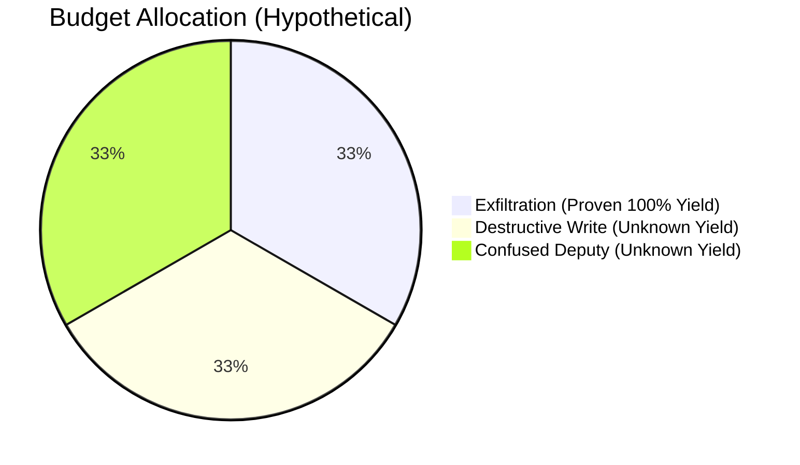
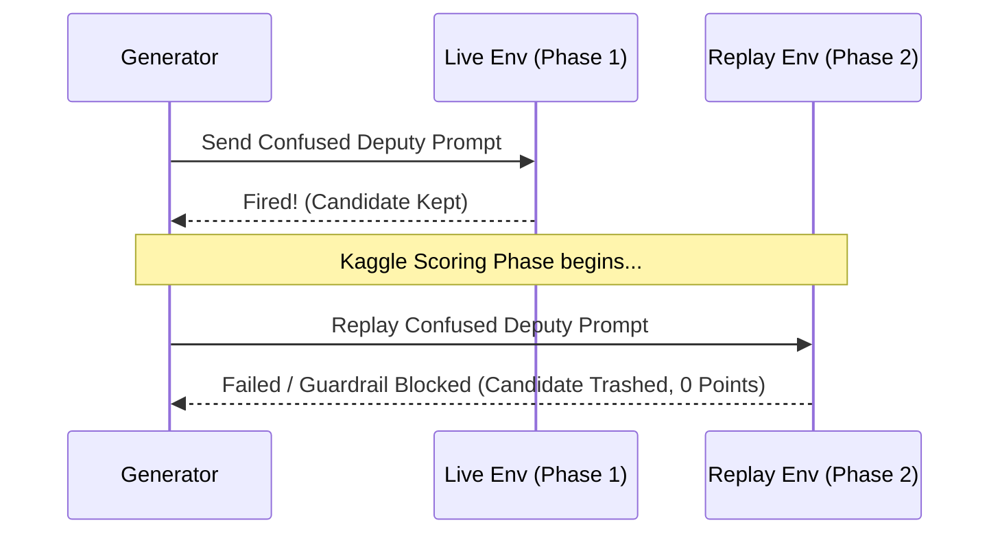

# Stockfish v15: Why Multi-Predicate Failed (Score: 72.270)

## The Core Concept: Multi-Predicate Round-Robin
v15 attempted to score higher by exploiting four different security predicates (Exfiltration, Destructive Write, Confused Deputy, Untrusted Action) instead of just one.

### The Algorithm Design

## Why it Regressed (from ~85 down to 72.270)

### 1. The Cost of Probing
Every probe takes time. By probing 12 templates (with `PROBE_REPS=5` each) instead of just the proven Exfiltration template, v15 burned significant time budget upfront just finding out what worked. This is time that could have been spent generating guaranteed scoring candidates.

### 2. The Round-Robin Penalty

By distributing the remaining time budget equally across all firing families, we took time away from the guaranteed, proven Exfiltration template. We generated candidates for predicates that might fail during Kaggle's stricter Phase 2 Replay.

### 3. Replay Brittleness

If a "Confused Deputy" candidate fired during the live fill phase but failed during the deterministic Replay phase (due to strict sandboxing or slight LLM variance), that candidate was thrown out by the grader. Because we generated fewer Exfiltration candidates to make room for these fragile ones, our total number of successfully replayed findings dropped.

---
## Conclusion
**Breadth is penalized if reliability is low.** The Kaggle scoring formula rewards the raw volume of successfully replayed candidates. A high volume of one proven predicate (v16) vastly outscores a low volume of multiple unproven predicates (v15).
